#  PWA-Builder Extension

This extension allow you create the necesaries images for manifest file, package the project as Appx file and execute an appx package.

## Prerequisites

You will need the following things properly installed on your computer.

* [Git](http://git-scm.com/)
* [Node.js](http://nodejs.org/) (with NPM)
* [NPM](http://npmjs.com/)

## Dependecies

* [CloudAppx-Server](https://www.npmjs.com/package/cloudappx-server)
* [HWA](https://www.npmjs.com/package/hwa)
* [Filehound](https://www.npmjs.com/package/filehound)
* [PWA-Builder](https://www.npmjs.com/package/pwabuilder-windows10) (Windows 10)

## Installation

* `git clone <repository-url>` this repository
* change into the new directory
* `npm install`

## Pallet Commands

|  **&nbsp;&nbsp;&nbsp;&nbsp;&nbsp;&nbsp;Command&nbsp;&nbsp;&nbsp;&nbsp;&nbsp;&nbsp;** | **Description** |
| ----------------- | --------------- |
| `Appx Package`     | This command generates the Appx package |
| `Execute Package`     | Execute a app from manifest.xml file |
| <a href="README.md#imggen">Image Generator</a>    | Generates the images that you need for manifest.   |

## Commands Guide
### Appx Packaging
Select manifest.json  
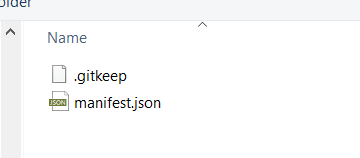

Select the output folder in which you want the package will be saved.  
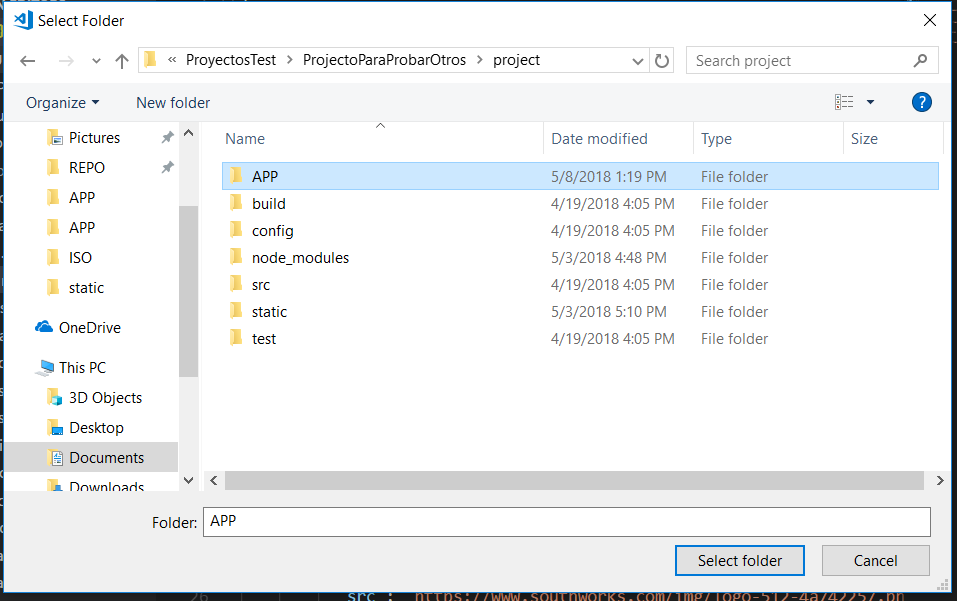

Select the platform where the package will be installed  

Wait a moment, take a cup of coffee and an information message will show up when the package be ready  
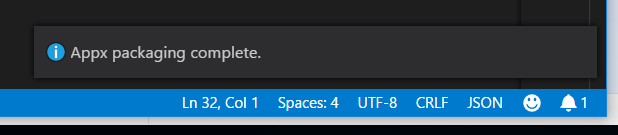

When all be done, open the folder that you choose before and you will see the following files: __Test__ (site's folder), __appxmanifest.xml__ and __Test.appx__ (site's package).  
The directory and package names will be the same of the manifest's short name property, file that we selected at the beggining of the process.

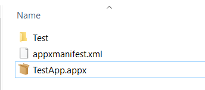

* __Site Folder__: This folder contains all the files that was created by the PWA-Builder.
* __Appx Manifest__: This file is a XML file that has been created by the PWA-Builder package and it's needed for the packaging process.
* __Site Package__: If we double click it, this gonna open the site as Windows App.

### Execute Project

Select the manifest file that you want execute (It must be a XML file).  
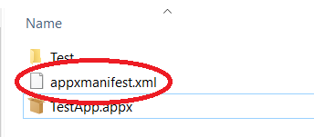

### Image Generator

Select the image that you want for the site's icon.  
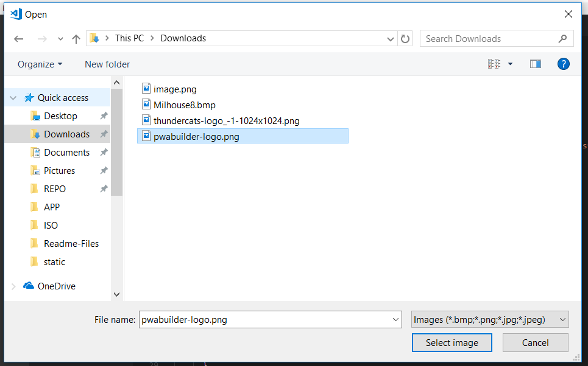

Select the platforms  
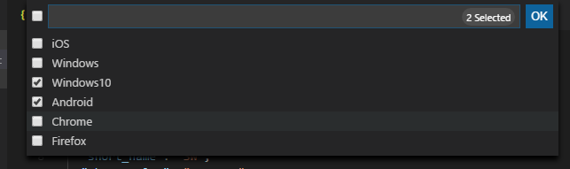

Insert the padding value that you want for the image.  
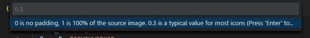

Select whether the background will be transparent or a color which must be entered as a hexadecimal code in the following step.   
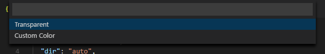

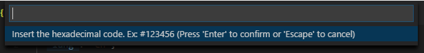

Select __assets__ folder  
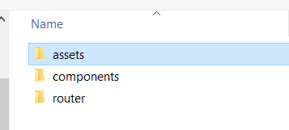

Select the __manifest.json__  
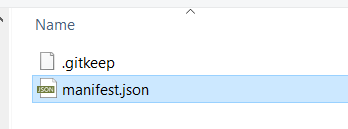

#### Before command execute 
Assets Folder  

Manifest File  
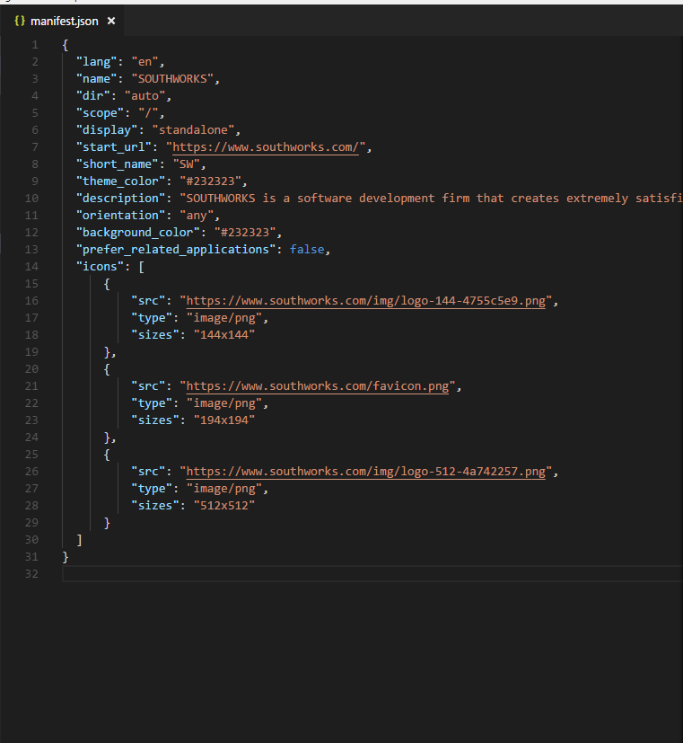

#### After command execute 
Assets Folder  
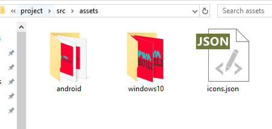

Manifest File  
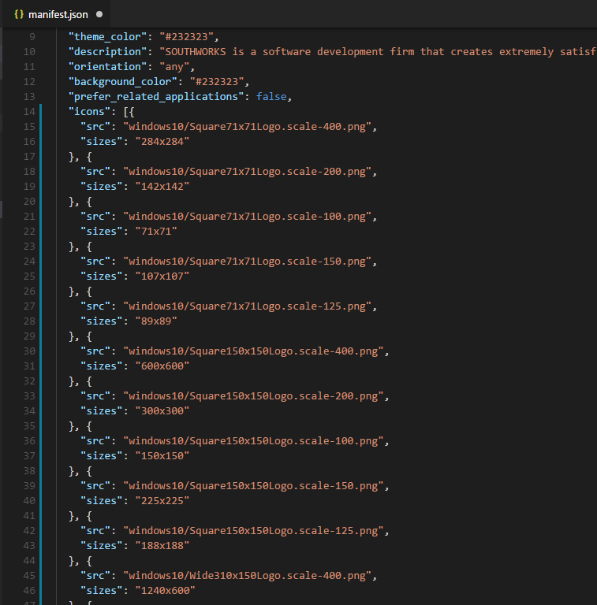

## Built With

* VS Code
* Node.js
 

## License

This project is licensed under the MIT License - see the [LICENSE.md](LICENSE.md) file for details

## Acknowledgments

* [PWA-Builder](http://www.pwabuilder.com)
