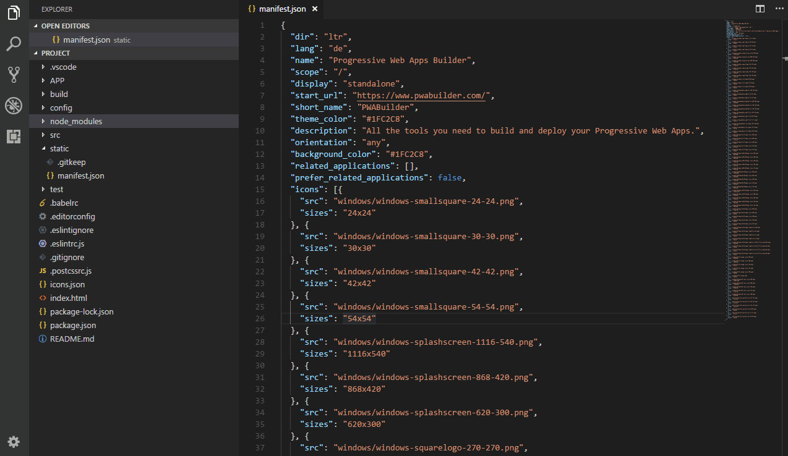
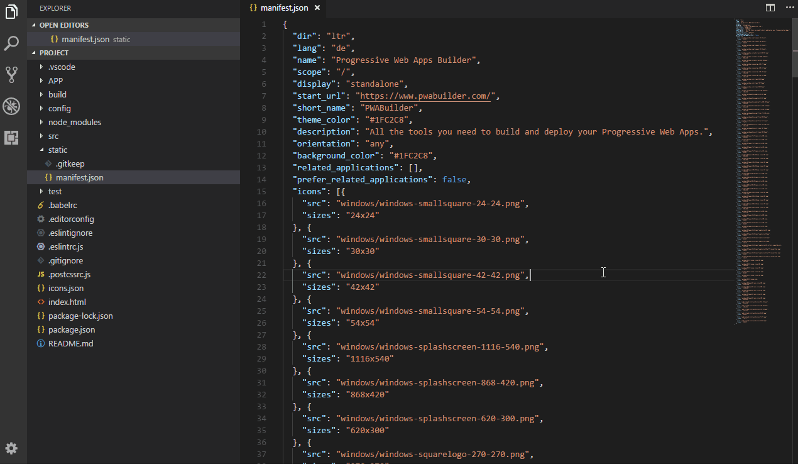
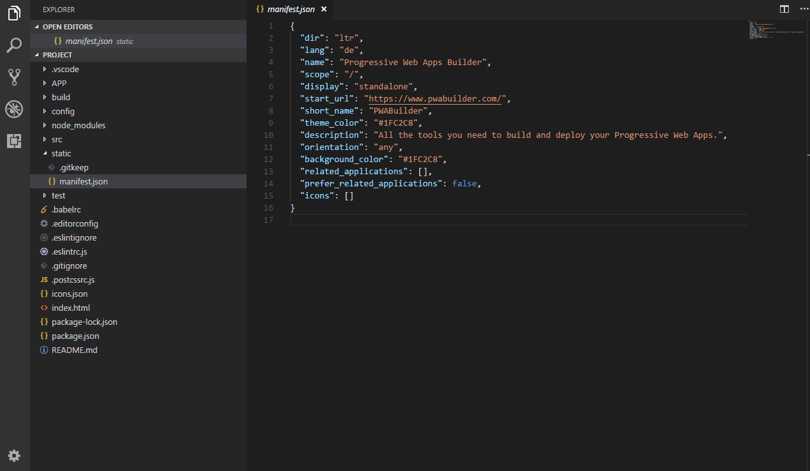

# PWA-Builder BETA

This extension allow you create the necesaries images for manifest file, package the project as Appx file and execute an appx package from a directory.

## Table of Contents

* Prerequisites
* Installation
* Table of Commands
* How to use?
  * Appx Packaging
  * Execute Project
  * Image Generator
  

## Prerequisites

You will need the following things properly installed on your computer.

* [Git](http://git-scm.com/)
* [Node.js](http://nodejs.org/) (with NPM)

## Installation

* `git clone <repository-url>` this repository
* change into the new directory
* `npm install`

## Table of Commands

|  **&nbsp;&nbsp;&nbsp;&nbsp;&nbsp;&nbsp;Command&nbsp;&nbsp;&nbsp;&nbsp;&nbsp;&nbsp;** | **Description** |
| ----------------- | --------------- |
| <a href="README.md#appxpackage">Appx Package</a>       | This command generates the Appx package |
| <a href="README.md#exepackage">Execute Package</a>    | Execute a app from manifest.xml file |
| <a href="README.md#imggen">Image Generator</a>    | Generates the images that you need for manifest.   |

## How to use?

## Appx Packaging

* Select manifest.json
* Select the output folder in which you want the package will be saved.
* Select the platform where the package will be installed

### Result description: 

* __Site Folder__: This folder contains all the files that was created by the PWA-Builder.
* __Appx Manifest__: This file is a XML file that has been created by the PWA-Builder package and it's needed for the packaging process.
* __Site Package__: If we double click it, this gonna open the site as Windows App.

## Execute Project

Select the application file that you want execute (It must be the appxmanifest.xml file on Windows and APP on Mac).  

## Image Generator

* Open the Command Pallete 
* Select the `App Image Generator` option.
* Select the __image__ that you want for the app
* Select the __platforms__ where the app will be used 
* Set the __image padding__ and __image background__ (this could be transparent or a hexadecimal) values
* Set the __assets__ folder path
* Set the __manifest.json__ file path 

## Built With

* VS Code
* Node.js

